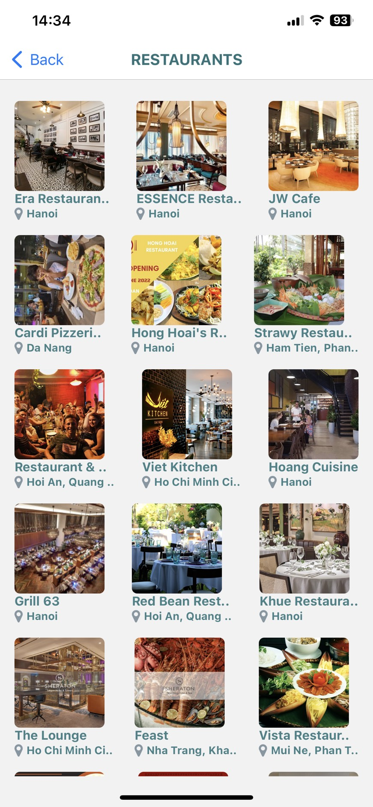
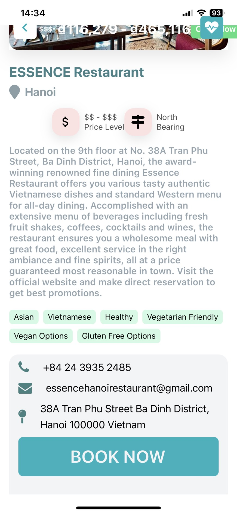

<ul>
<li>
 Cho phép người dùng tìm kiếm (địa điểm du lịch, nhà khàng, khách sạn) ở một nơi bất kì trên thanh Tìm kiếm.
  Dữ liệu được lấy từ <a src="https://rapidapi.com/hub">RapidAPI</a> (Travel Advisor).
</li>
<li>
 Khi người dùng click vào một kết quả vào đó thì ứng dụng sẽ trả về toàn bộ thôn tin (địa điểm, giá, tên, vị trí,...) của địa danh đó.</li><li>
 Tại đây người dùng có thể đặt thuê tùy theo nhu cầu của họ.
</li>
<li>
 Để đặt thì người dùng cần phải đăng nhập trước để tiến hành xác minh người dùng để dễ dành thanh toán.
</li>
<li>
 Nếu chưa có tài khoản thì người dùng có thể đăng kí. Toàn bộ thông tin người dùng đều được mã hóa và lưu trực tiếp trên mongooseDB.
</li>
<li>
 Người dùng cũng có thể thay đôi thông tin cá nhân của họ 1 cách dễ dàng.
</li>

</ul>
<b>DEMO</b>

